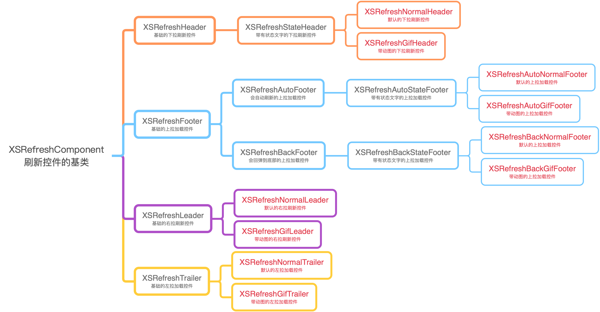

# XSRefresh

[English](README.md)|[简体中文](README.zh_CN.md)

XSRefresh的类结构图：



- 上图中`红色文字的类` ：你可以直接使用
    - 下拉刷新控件类：
        - 普通：`XSRefreshNormalHeader`
        - 动图：`XSRefreshGifHeader`
    - 上拉加载控件类：
        - 自动加载：
            - 普通：`XSRefreshAutoNormalFooter`
            - 动图：`XSRefreshAutoGifFooter`
        - 回弹加载：
            - 普通：`XSRefreshBackNormalFooter`
            - 动图：`XSRefreshBackGifFooter`
- 上图中`非红色文字的类` ：可以继承，自定义刷新控件。
- 关于如何自定义刷新控件，可以参考`XSRefreshExample`。

### XSRefreshComponent

```swift
/* 刷新控件基类 */
class XSRefreshComponent: UIView {
  /* 控制刷新状态 */
  /* 开始刷新 */
  func beginRefreshing(withCompletion block: (() -> Void)? = nil) {}
  /* 结束刷新 */
  func endRefreshing(withCompletion block: (() -> Void)? = nil) {}
  /* 是否在刷新中 */
  var refreshing: Bool
  
  /* 根据距离阻力自动改变透明度 */
  var automaticallyChangeAlpha: Bool
} 
```

### XSRefreshHeader

```swift
class XSRefreshHeader: XSRefreshComponent {
  /* 创建 Header */
  class func header(WithRefreshing block: @escaping XSRefreshComponentAction) -> XSRefreshHeader {}
  convenience init(withRefreshing block: @escaping XSRefreshComponentAction) {}
  
  /* 创建 header */
  class func header(withRefreshing target: NSObject?, action: Selector?) -> XSRefreshHeader {}
  convenience init(withRefreshing target: NSObject?, action: Selector?) {}
  
  /* 该Key用于存储最后一次下拉刷新的时间 */
  var lastUpdatedTimeKey: String
  /* 最后一次下拉刷新的时间 */
  var lastUpdatedTime: Date
  
  /* 忽略滚动视图的内容的顶部距离 */
  var ignoredScrollViewContentInsetTop: CGFloat
}
```

### XSRefreshFooter

```swift
class XSRefreshFooter: XSRefreshComponent {
  /* 创建 footer */
  class func footer(withRefreshing block: @escaping XSRefreshComponentAction) -> XSRefreshFooter {}
  convenience init(withRefreshing block: @escaping XSRefreshComponentAction) {}
  
  /* 创建 footer */
  class func footer(withRefreshing target: NSObject?, action: Selector?) -> XSRefreshFooter {}
  convenience init(withRefreshing target: NSObject?, action: Selector?) {}
  
  /* 结束加载且没有更多数据了 */
  func endRefreshingWithNoMoreData(completion block: (() -> Void)? = nil) {}
  /* 重置没有更多数据状态（重设noMoreData状态） */
  func resetNoMoreData() {}
  
  /* 忽略滚动视图的内容的底部距离 */
  var ignoredScrollViewContentInsetBottom: CGFloat
}
```

### XSRefreshAutoFooter

```swift
class XSRefreshAutoFooter: XSRefreshFooter {
  /* 是否自动刷新（默认自动刷新） */
  var automaticallyRefresh: Bool = true
  
  /* 当控件底部有多少内容时自动刷新（默认为1.0，在控件底部出现完整时，自动刷新） */
  var triggerAutomaticallyRefreshPercent: CGFloat = 1.0
}
```

